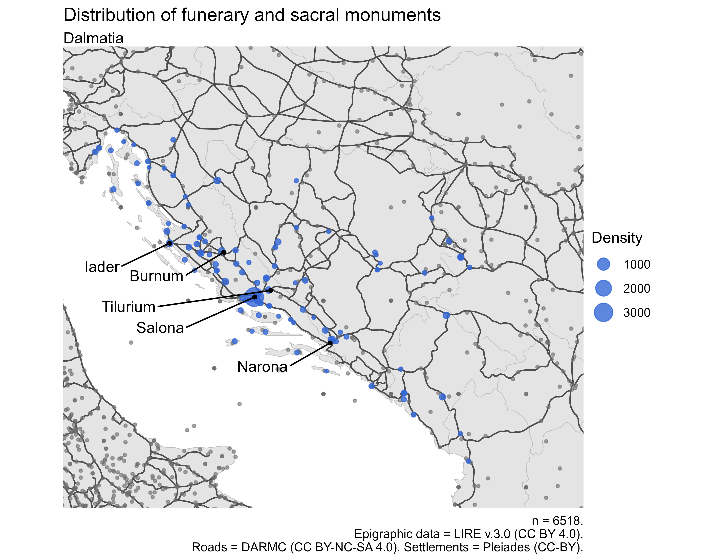
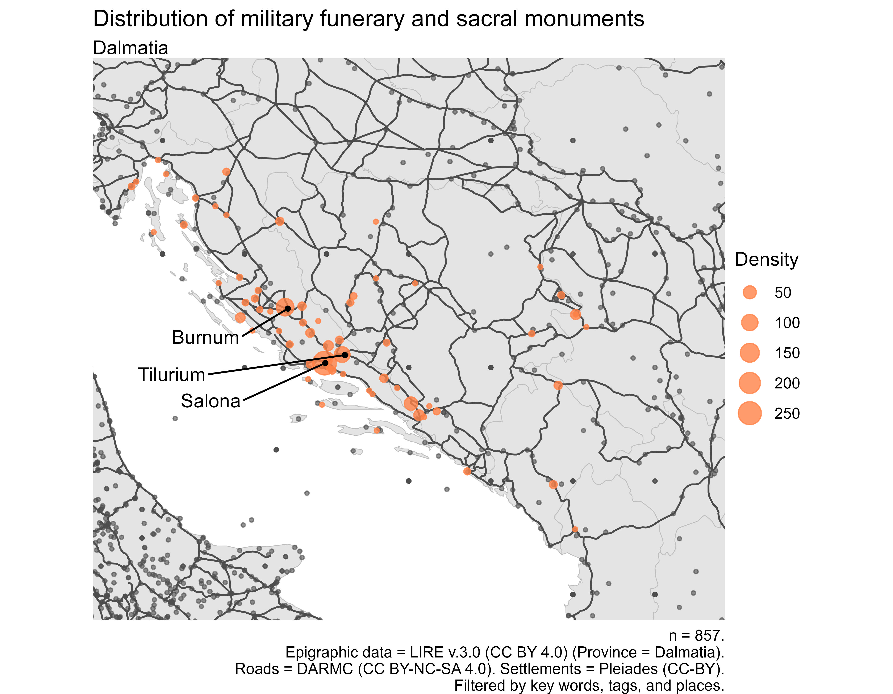
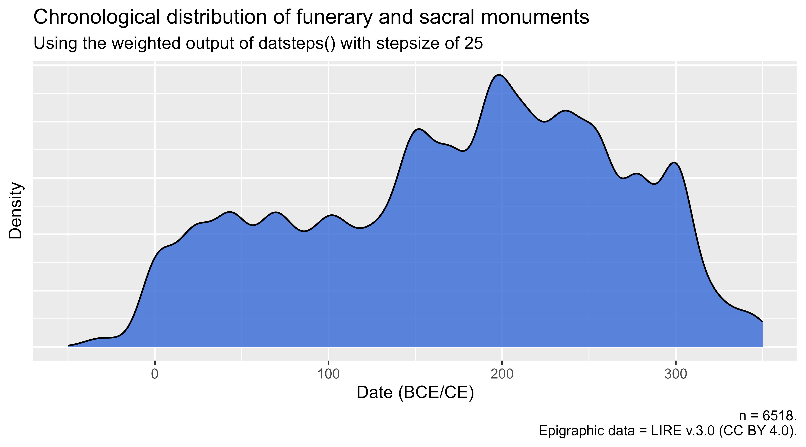

# Bromans_with_R
Repository for data, scripts, and outputs related to data collection, cleaning, and analysis for the 2021-2025 PhD project "_Military-becoming_" _in Dalmatia and beyond: An assemblage thinking framework for Roman Archaeology_.

## Project description

## Overview

## Example outputs:

<figcaption> Scatter map of inscribed Latin monuments in Dalmatia. CC BY-SA 4.0</figcaption>

 

<figcaption> Scatter map of Roman military epigraphic monuments in Dalmatia. CC BY-SA 4.0</figcaption>

 

<figcaption> Scaled density graph of inscribed monuments in Dalmatia, following Steinmann & Weissova 2021. CC BY-SA 4.0</figcaption> 
 

 

<figcaption> Scaled density graph of inscribed military monuments in Dalmatia, following Steinmann & Weissova 2021. CC BY-SA 4.0</figcaption> 
 

## Thesis
- Coopey, E S. forthcoming. '"Military-becoming" in Dalmatia and beyond: An assemblage thinking framework for Roman Archaeology.' _PhD thesis_. Macquarie University.

## Readings on methodology
- Heřmánková, P, V Kaše, and A Sobotkova. 2021. 'Inscriptions as Data: Digital Epigraphy in Macro-Historical Perspective.' _Journal of Digital History_ 1(1): 99. DOI:[10.1515/jdh-2021-1004](https://doi.org/10.1515/jdh-2021-1004).
- Steinmann, L, and B Weissova. 2021. ‘Datplot: A New R Package for the Visualization of Date Ranges in Archaeology’. _Advances in Archaeological Practice_ 9(4). DOI:[10.1017/aap.2021.8](https://doi.org/10.1017/aap.2021.8).