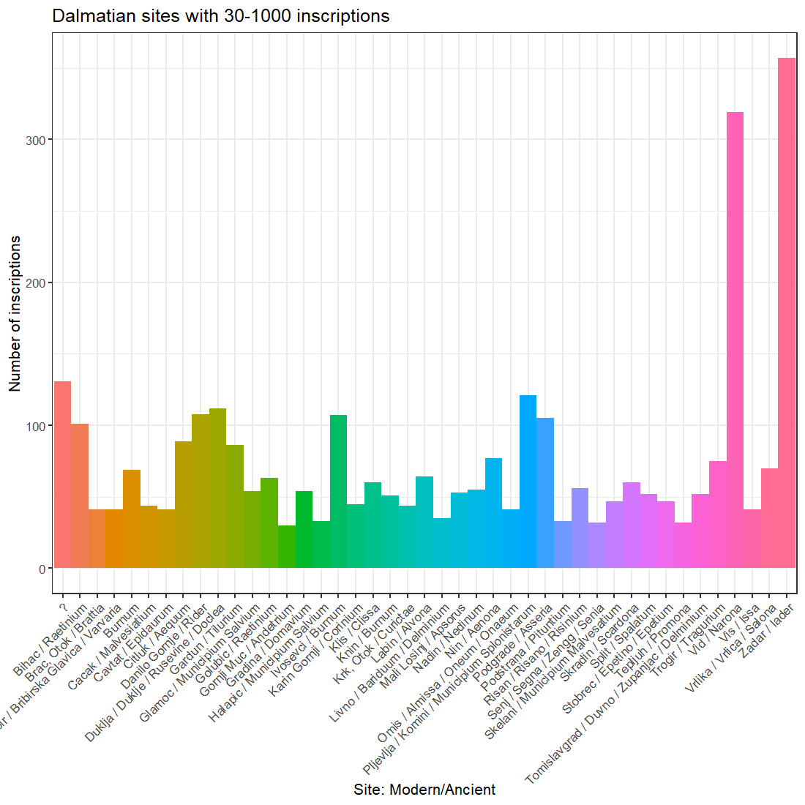

# Bromans_with_R
Working with R to handle epigraphic and GIS data for my PhD project. Some related epigraphic and archaeological data can be found at my [BromansCoopey Repo](https://github.com/EwanSC/BromansCoopey).

## Specs
Programs: RStudio  
Programming: R  
Desktop: Dell Inspiron 15 7000  

## Some of the outputs so far:

<figcaption> Scatter map of all locations where Roman epigraphy has been found in Dalmatia. CC BY-SA 4.0</figcaption>

 

<figcaption> Scatter map with scaled points showing number of epigraphic monuments shown at sites across Dalmatia dating to 30 BCE-150CE. CC BY-SA 4.0</figcaption> 

 

<figcaption> Column graph of the places in Dalmatia where more than 30 and less than 1000 inscriptions have been found. CC BY-SA 4.0</figcaption> 
