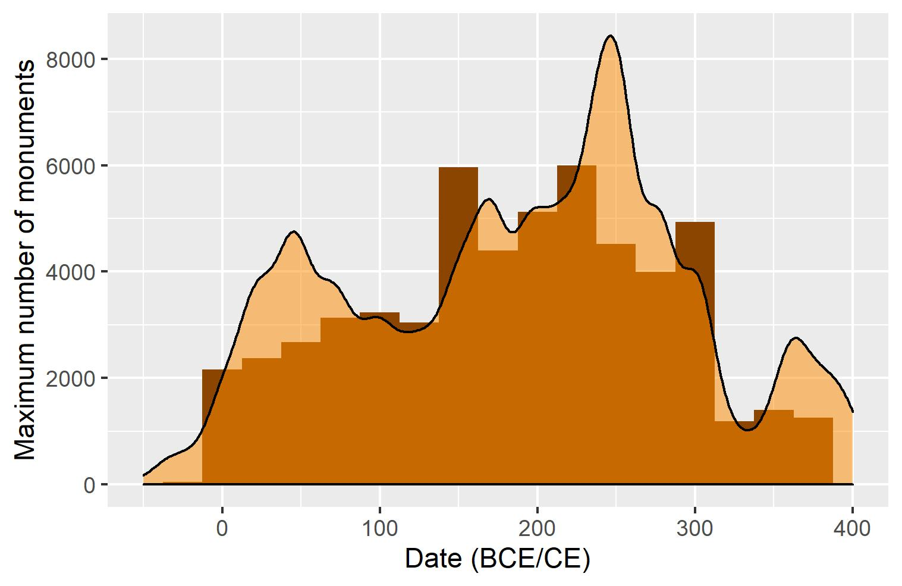

# Bromans_with_R
Working with R to handle epigraphic and GIS data for my PhD project. Some related epigraphic and archaeological data can be found at my [BromansCoopey Repo](https://github.com/EwanSC/BromansCoopey) or at [zenodo.7052901](https://doi.org/10.5281/zenodo.7052901).

## Example outputs:

<figcaption> Map of the distribution of military epigraphic monuments in Dalmatia dating between 30BCE--150CE (-30/117--117/150). CC BY-SA 4.0</figcaption>

 

<figcaption> Scatter map of all locations where Roman epigraphy has been found in Dalmatia. CC BY-SA 4.0</figcaption>

 

<figcaption> Scatter map with scaled points showing number of epigraphic monuments shown at sites across Dalmatia dating to 30 BCE-150CE. CC BY-SA 4.0</figcaption> 

 

<figcaption> Scaled density graph of inscribed monuments in Dalmatia with histogram and 25 step size, folowing Steinmann & Weissova 2021. CC BY-SA 4.0</figcaption> 
 

Steinmann, L, and B Weissova. 2021. ‘Datplot: A New R Package for the Visualization of Date Ranges in Archaeology’. _Advances in Archaeological Practice_ 9(4). DOI:[10.1017/aap.2021.8](https://doi.org/10.1017/aap.2021.8).

## Specs:
Programs: RStudio. 2023.06.0 Build 421. "Mountain Hydrangea" Release (583b465e, 2023-06-05) for windows  
Programming: R  
OS: Windows 11 Pro. V.22H2 (OS Build 22621.3007)  