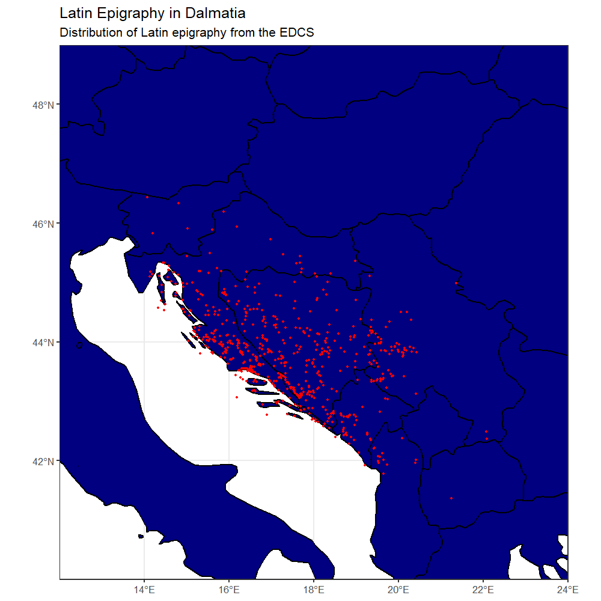

# Bromans_with_R
Working with R to handle epigraphic and GIS data for my PhD project. Some related epigraphic and archaeological data can be found at my [BromansCoopey Repo](https://github.com/EwanSC/BromansCoopey) or at [zenodo.7052901](https://doi.org/10.5281/zenodo.7052901).

## Example outputs:

![scaled scatter map of the distribution of military stelae in roman dalmatia. title reads Epigraphic Distribution of the Military in Dalmatia, subtitle reads Undated Monuments and Monuments Dated 30 BCE–150 CE. x-axis goes from 12 east to 22 east. y-axis goes from 41 north to 46 and a half north. map is of the eastern Adriatic coastline. the land mass is marked out in grey, with modern country lines marked out in black and the modern borders of countries in dark grey. red circles of varying sizes cluster along the coastline from north to south, with select small red dots in the hinterland. the key consists of 4 red circles increasing in size, with the smallest representing 25, the second 50, the thrid 75, and the last 100.](output_images/dated_military_scatter.png)
<figcaption> Map of the distribution of military epigraphic monuments in Dalmatia dating between 30BCE--150CE (-30/117--117/150). CC BY-SA 4.0</figcaption>

 

<figcaption> Scatter map of all locations where Roman epigraphy has been found in Dalmatia. CC BY-SA 4.0</figcaption>

 

<figcaption> Scatter map with scaled points showing number of epigraphic monuments shown at sites across Dalmatia dating to 30 BCE-150CE. CC BY-SA 4.0</figcaption> 
 

## Specs:
Programs: RStudio. 2022.07.2 Build 576. "Spotted Wakerobin" Release (e7373ef8, 2022-09-06) for Windows  
Programming: R  
OS: Windows 11 Pro. V.22H2  